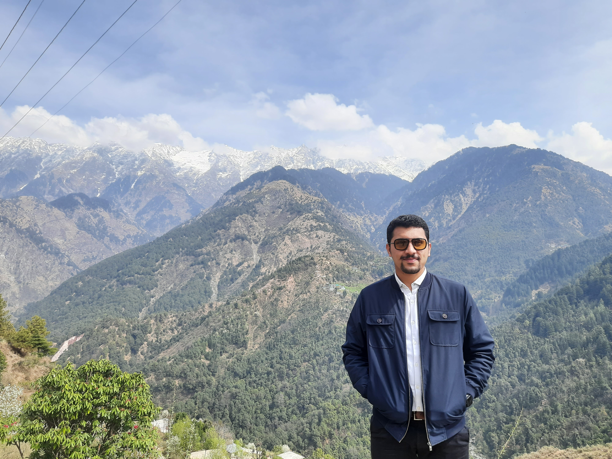

  

## Bio ##
I'm working as a Research Associate at the [ICAR-National Institute of Agricultural Economics and Policy Research](https://niap.icar.gov.in/), New Delhi, India. 

  I hold a Ph.D. degree in Agricultural Economics from the [Punjab Agricultural University](http://pau.edu/), Ludhiana, Punjab, India. The title of my Ph.D. dissertation was "Maize Production in Punjab: Competitiveness and Future Outlook". Prior to my doctoral studies, I earned an M. Sc. (Agri) in Agricultural Economics from the [CSK Himachal Pradesh Agriculture University](http://hillagric.ac.in/indexold.htm), Palampur (H.P.) in 2019 and a B.Sc. in Agriculture degree from the [Punjab Agricultural University](http://pau.edu/), Ludhiana (Punjab) in 2017.

   
My research interests include climate change, climate variability, climate resilience, GHG emissions, carbon footprint, carbon budgeting, water footprint, agricultural marketing, marketing channels, value chain analysis, Economics of agriculture & allied activities, Labour utilization & productivity, Sustainable agrifood system (SAS), organic farming, sustainable agriculture system, Sustainable water management, water scarcity, agricultural policy evaluation.

