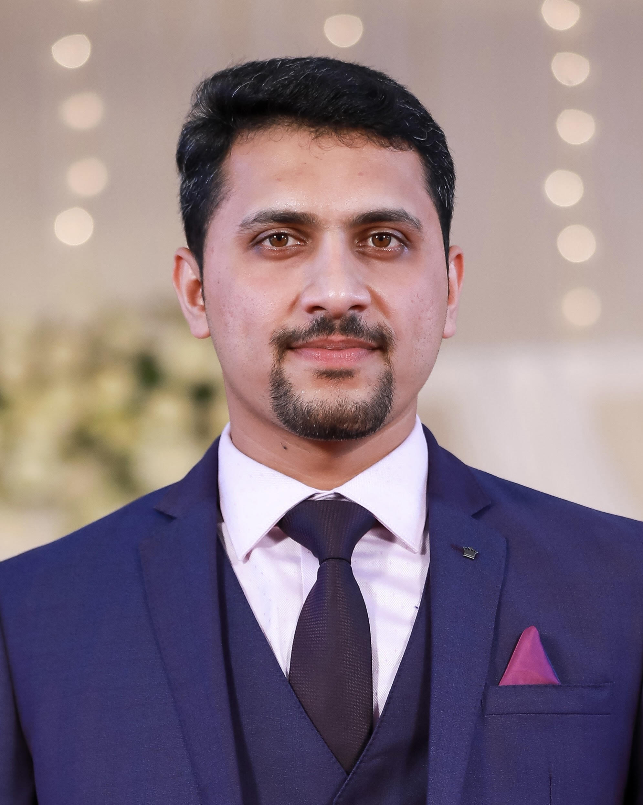

<section class="hero">
  

    
Environmental and Resource Economist

    <h1>A. G. Adeeth Cariappa</h1>
    
I study agricultural carbon markets, sustainable food systems, and policy pathways that can reduce emissions while protecting farm incomes and rural livelihoods.

    

      <a class="button primary" href="/latest/">View research</a>
      <a class="button secondary" href="/CV.pdf">Download CV</a>
    

  

  <figure class="portrait-card">
    
    <figcaption>Associate Scientist, CIMMYT</figcaption>
  </figure>
</section>

<section class="credibility-strip" aria-label="Research focus">
  

    <strong>CIMMYT</strong>
    Sustainable Agrifood Systems
  

  

    <strong>Carbon markets</strong>
    Agriculture and climate policy
  

  

    <strong>Impact evaluation</strong>
    Evidence for better programs
  

</section>

## About

I am an Associate Scientist - Environmental and Resource Economist in the Sustainable Agrifood Systems Program at the [International Maize and Wheat Improvement Center (CIMMYT)](https://www.cimmyt.org/), based at the CIMMYT office on the ICRISAT campus in Hyderabad, India.

My research focuses on the economics of carbon farming, agricultural carbon credit markets, climate-smart agriculture, and sustainable food systems. I examine whether carbon crediting projects are financially viable, environmentally credible, and socio-economically inclusive, with particular attention to the trade-offs between agricultural productivity, emissions reduction, and rural livelihoods.

Previously, I worked as a Post-Doctoral Fellow at CIMMYT, a Young Professional in the Agriculture and Allied Sectors Vertical of [NITI Aayog](https://www.niti.gov.in/), and a Consultant - Dairy Market for the [Food and Agriculture Organization of the United Nations](https://www.fao.org/about/en/). I hold a Ph.D. from ICAR-National Dairy Research Institute, Karnal.

<section class="feature-grid">
  <article>
    01
    <h3>Agricultural carbon credits</h3>
    
Designing credible, inclusive, and durable carbon-market pathways for smallholder agriculture.

  </article>
  <article>
    02
    <h3>Climate-smart farming</h3>
    
Assessing conservation agriculture, climate-adaptive varieties, residue management, and emission-intensity reduction strategies.

  </article>
  <article>
    03
    <h3>Policy and impact evidence</h3>
    
Using applied economic tools to understand adoption, welfare, resilience, and program design.

  </article>
</section>

## Selected Work

<section class="selected-work">
  <article>
    
2025 - Environmental Research Letters

    <h3>On Biodiversity-Inclusive Carbon Crediting in Agriculture</h3>
    
Insights from crop residue burning and the need to account for biodiversity in agricultural carbon-credit design.

    <a href="https://iopscience.iop.org/article/10.1088/1748-9326/ae2492">Open access</a>
  </article>
  <article>
    
2025 - Climate Policy

    <h3>Carbon Farming in India</h3>
    
Evidence on whether existing projects are inclusive, additional, and permanent.

    <a href="https://www.tandfonline.com/doi/full/10.1080/14693062.2024.2416497">Open access</a>
  </article>
  <article>
    
2024 - Scientific Reports

    <h3>Conservation Agriculture and Carbon Credits</h3>
    
An evaluation of the potential and eligibility of conservation agriculture practices for carbon credits.

    <a href="https://www.nature.com/articles/s41598-024-59262-6">Open access</a>
  </article>
</section>

<a href="/latest/">See all publications and articles</a>

